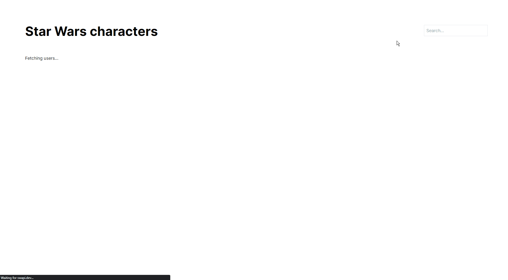

# Redux cat breeds list

Pet project for learning Redux, using Next.js

Expore cat breeds

## Features

- search
- pagination
- cat breeds are saved to redux

Demo: https://pet-cat-breeds-redux.vercel.app/

## What have I learned

- How to organize Redux store
- How to change state through actions and reducers
- How to use async logic with redux-thunk
- How to favicon (including Safari/IE, Android/iOS shortcuts, dark theme and future resizes)
